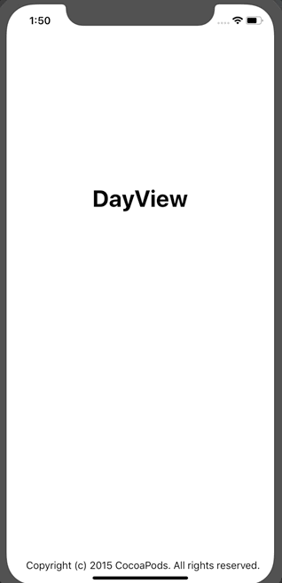

# DayView

[](https://travis-ci.org/NaveenMagatala/DayView)
[](https://cocoapods.org/pods/DayView)
[](https://cocoapods.org/pods/DayView)
[](https://cocoapods.org/pods/DayView)

## Example

To run the example project, clone the repo, and run `pod install` from the Example directory first.

## Requirements

iOS 11+, XCode 9+

## Usage



## Overview

* Dayview displays days and corresponding date in a collection view below it with infinite scroll, paging is enabled and only fetches data as you scroll through.
* As the view loads the collection view fetches three weeks, current week, previous week and the next week and fetches later weeks as we scroll through.
* Initially the collection view scrolls to the current week and highlights current day.
* Leaving collection view as public to customize colors.
* Please never set the delegate or data source of collection view indise the dayView, just use the delegate thats available directly on the dayView, the delegate currently only works with two methods

```
func collectionView(_ collectionView: UICollectionView, didSelectItemAt indexPath: IndexPath)

func collectionView(_ collectionView: UICollectionView, didEndDisplaying cell: UICollectionViewCell, forItemAt indexPath: IndexPath)

```
* Some other required methods can be exposed based on future requirement.


## Installation

DayView is available through [CocoaPods](https://cocoapods.org). To install
it, simply add the following line to your Podfile:

```ruby
pod 'DayView'
```

## Author

NaveenMagatala, naveenmagatala@gmail.com

## License

DayView is available under the MIT license. See the LICENSE file for more info.
